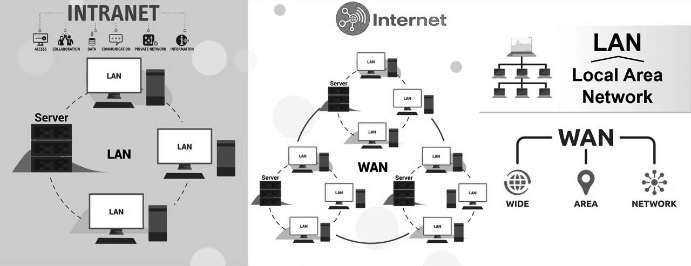
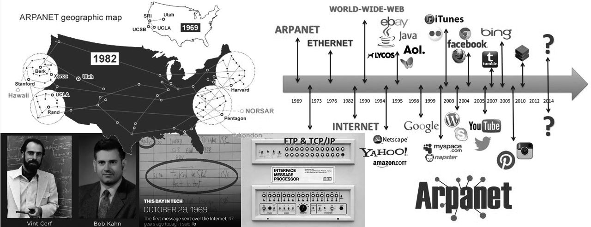
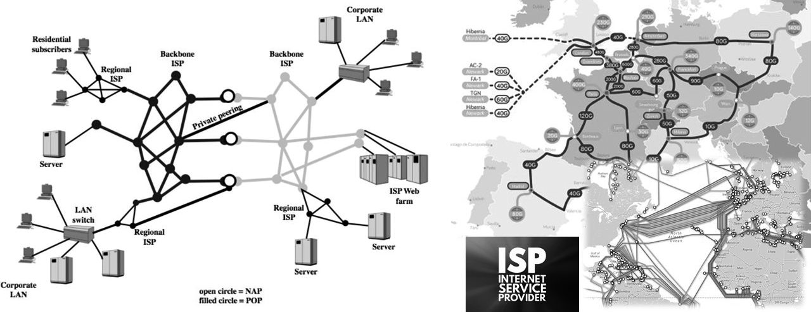
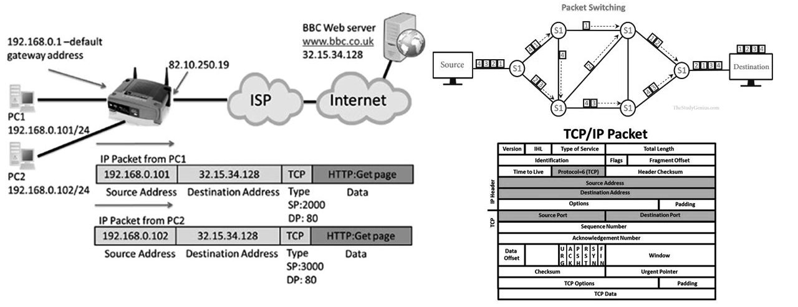

==================
Základy Internetu
==================

.. contents:: Obsah
    :depth: 3

Co je to Internet?
==================

Síť sítí
--------
Internet je celosvětová počítačová síť, která spojuje jednotlivé menší sítě. Název pochází z anglického slova *network* (síť), podle něhož tradičně názvy amerických počítačových sítí končily *„net“*, a mezinárodní (původně latinské) předpony *inter* (mezi), vyjadřující, že internet propojil různé lokální sítě.

WAN a LAN
---------
Internet můžeme považovat za síť typu **WAN** (*Wide Area Network* - "rozsáhlá síť"). Zkratkou **LAN** (*Local Area Network* - "místní síť") označujeme síťě uvnitř organizací (firmy, školy, úřadu) nebo i propojení zařízení v rámci domácí sítě. V těchto místních sítích mohou jejich uživatelé využívat uzavřené komunikační služby, které se symbolicky označují jako **intranet** ("vnitřní síť").

    Internet jako propojení WAN sítí a intranet jako propojení LAN sítí

Vývoj Internetu
===============

Na počátku byl ARPANET
----------------------
Internet původně vznikl na konci 60. let v době studené války jako vojenský experiment, který měl ověřit určité principy v oblasti datových komunikací. Cílem bylo ověřit, zda je možné přenášet data nejen v souvislém proudu, ale i v malých celcích, tzv. *datových paketech*.

K ověření těchto principů byla vybudována experimentální síť **ARPANET**, která byla financována vojenskou grantovou agenturou *Advanced Research Projects Agency* – ARPA, později přejmenovanou na DARPA. Síť byla uvedena do provozu v roce 1969 a na začátku byla tvořena 4 uzly. Po ukončení experimentu předala agentura síť akademickým institucím v USA. Během 70. a 80. let se na původní ARPANET připojovaly stále další akademické sítě.

.. admonition:: Víte, že...
    :class: vite-ze

    - Vojenský výzkum, který vedl k vzniku ARPANETu, byl zahájen v roce 1962. Výzkum byl iniciován v reakci na sovětský úspěch v kosmickém výzkumu a byl zaměřen na vývoj technologií, které by umožnily přežití v případě jaderného útoku.
    - První zpráva odeslaná po ARPANETu v roce 1969, kterou napsal *Charley Kline* z *UCLA* na *Stanford Research Institute*, byla nechtěně zkrácena. Zpráva měla obsahovat slovo "LOGIN", ale kvůli výpadku sítě se podařilo odeslat jen první dvě písmena - "LO".
    - V roce 1971 byl na ARPANETu odeslán první e-mail. Byl poslán *Rayem Tomlinsonem*, který byl také autorem prvního e-mailového klienta.
    - První zahraniční uzel ARPANETu byl připojen v roce 1973 v Británii. V roce 1975 byl připojen první uzel v Evropě, v Norsku. V roce 1976 byl připojen první uzel v Austrálii a v roce 1977 v Izraeli. V roce 1979 byl připojen první uzel v Japonsku.

Zrození Internetu
-----------------
Za "otce internetu" bývá označován americký informatik *Vint Cerf*, který se svým spolupracovníkem *Bobem Kahnem* použil v roce 1974 poprvé zkrácený pojem *internet* (místo delšího *internetworking*). Společně také stáli za vznikem **rodiny protokolů TCP/IP**, který je od 1. ledna 1983 oficiálně používán jako základní komunikační protokol celosvětové sítě.

.. admonition:: Víte, že...
    :class: vite-ze

    - *1. leden 1983*, datum oficiálního přijetí TCP/IP jako základního komunikačního protokolu, bývá označován jako "Den narození Internetu", anglicky *Internet Day*.  
    - Cerf a Kahn jsou také autory tzv. *Cerf-Kahnovy architektury* (též *Internetové architektury*), která popisuje základní principy fungování Internetu. Oba byli v roce 2004 oceněni Turingovou cenou, nejprestižnější světovou cenou v oblasti informatiky.
    - Vint Cerf je také známý tím, že se stal jedním z prvních lidí, kteří využili Internet k odeslání e-mailu. V roce 1971 poslal e-mail svému kolegovi na jiné univerzitě. Stal se i jedním z prvních uživatelů Internetu, kteří využili tzv. *Internet of Things* (IoT) - v roce 1978 připojil k Internetu automatický toaster. A patřil rovněž k prvním uživatelům, kteří využili Internet k hlasové komunikaci - v roce 1978 se mu podařilo uskutečnit hovor přes Internet. V neposlední řadě patří Vint Cerf k těm, kdo se pokusili vytvořit tzv. *mezihvězdný Internet*; v roce 2008 se mu podařilo odeslat e-mail na Mezinárodní vesmírnou stanici (ISS) a v roce 2011 mailoval dokonce na Mars. 

V roce 1986 došlo ke změně financování rozšiřující se akademické sítě – aktivitu v tomto směru přebírá civilní grantová agentura NSF (National Science Foundation). Ta se rozhodla posílit a dobudovat vlastní páteřní síť a dala ji název NSFNET. V osmdesátých letech se k tomuto původně ryze americkému projektu začaly připojovat i některé zahraniční akademické instituce.

Na počátku 90. let došlo k otevření této celosvětové sítě i pro komerční aktivity, která již pod názvem Internet přestala být současně dotována z peněz daňových poplatníků. V její soustavě začaly převažovat soukromé komerčně provozované sítě jednotlivých poskytovatelů.

V roce 1993 se k Internetu připojují první česká místa, vzniká síť CESNET, propojující české vysoké školy.

    Vývoj Internetu a jeho otcové - Vint Cerf a Bob Kahn

Struktura Internetu
===================

Poskytovatelé Internetu
-----------------------
Samotný Internet tedy nikdo nevlastní, ale je tvořen sítěmi, které provozují jednotliví poskytovatelé. Ti se mezi sebou propojují a vytvářejí tak celosvětovou síť.

Sítě jsou propojovány *hierarchickým způsobem* – jeden významnější poskytovatel (*upstream provider*, *backbone ISP*) se tak vůči druhému stává poskytovatelem konektivity a menší poskytovatelé zase disponují menšími sítěmi dalších lokálních poskytovatelů (*downstream provider*, *regional ISP*).
 
Poskytovatel internetového připojení (**ISP** - *Internet service provider*), je firma nebo organizace prodávající nebo poskytující přístup do Internetu a příbuzné služby.

Technická řešení sítí
--------------------- 
*Páteřní spoje* internetu (anglicky *backbone*) jsou dnes realizovány zejména pomocí optických kabelů. Klíčovou roli hrají podmořské kabely, které propojují kontinenty. Páteřní spoje jsou realizovány i pomocí satelitních spojů, ale ty jsou dnes již spíše doplňkové.
 
Důležité jsou i spojení tzv. *"poslední míle"* - způsob, jak se k páteřní síti připojují koncoví uživatelé. V současnosti existuje několik možností pro připojení počítače k internetu: pomocí telefonní linky (majitelem linky je telefonní operátor), pomocí kabelové televize nebo vyhrazené linky, pomocí satelitní datové sítě, pozemní bezdrátové datové sítě nebo mobilní telefonní sítě. 

Propojení sítí
--------------
Kdyby zůstala striktně zachována hierarchičnost Internetu, procházela by většina spojení přes páteřní propojovací body, tzv. **NAP** (*Network Access Point*), které se většinou nacházely v zámoří a provoz Internetu by z toho důvodu byl velmi neefektivní a pomalý. 

V průběhu 90. let minulého století docházelo ke vzniku tzv. *peeringových center*. **Peering** je přímé propojení mezi poskytovateli za účelem vzájemného a přímého předávání dat. Tento neutrální peeringový bod vznikl pro ČR v Praze a jeho provoz zajišťuje sdružení `NIX.CZ <https://nix.cz/cs>`_. 

    Hierarchická struktura Internetu a páteřní spoje

Principy Internetu
==================

Decentralizovaná síť
--------------------
Zrod Internetu byl úzce spojen se snahou vytvořit robustní komunikační síť, která mohla odolat i případnému jadernému útoku a zničení centrálních uzlů, na nichž byla založena tradiční telefonní síť a v ní používaná technologie **přepojování okruhů**. 

Cíle *decentralizovat komunikaci* bylo dosaženo vyvinutím alternativní technologie **přepojování paketů**.

Datové pakety a jejich směrování
--------------------------------
Základní princip je *analogií poštovní služby*: data jsou posílána postupně v menších "balících" - jako tzv. **datové pakety** (anglicky *packets*). Každý paket v sobě nese informaci (*IP adresu*) odesilatele i příjemce a je počítačovou sítí doručován samostatně.

**Směrování** v uzlech sítě zajišťují specializované přepínače (například *switch*, *router*). Jednotlivé pakety mohou sítí putovat různými cestami, a proto mohou k příjemci dorazit za různě dlouhou dobu i v odlišném pořadí. 

Hlavní výhodou takového síťového provozu je možnost použít k přepravě paketů *alternativní cestu*, dojde-li k výpadku nebo zahlcení jednoho ze spojení. Pokud se při přepravě některý z paketů ztratí, nemusí být opakováno vysílání celé zprávy, ale stačí znovu poslat jen nedoručený paket.

Rodina protokolů TCP/IP
-----------------------
Na straně příjemce pak musí proběhnout poskládání všech souvisejících paketů do správného pořadí, aby posílaná data získala původní podobu a dávala smysl. K tomuto účelu se využívají *metadata* (různé pomocné informace), jež jsou součástí každého paketu. Důležitou roli v tom hrají rovněž tzv. **protokoly**.

Pro komunikaci v Internetu se používá rodina protokolů **TCP/IP**, která je základem celosvětové sítě. Protokol představuje soubor pravidel, která určují, jak mají být data přenášena v počítačové síti. Základem TCP/IP jsou dva klíčové protokoly: **TCP** (*Transmission Control Protocol*) a **IP** (*Internet Protocol*).

Zatímco protokol *TCP* zajišťuje spolehlivé doručení dat, protokol *IP* zajišťuje směrování datových paketů v síti. Využívá k tomu tzv. **IP adres**, které identifikují jednotlivé počítače a další zařízení připojené k síti.

    Technologie přepojování paketů a rodina protokolů TCP/IP jsou základem Internetu

.. admonition:: Doporučené odkazy
    :class: doporucene-odkazy 

    Další informace o Internetu a jeho principech můžete najít na následujících webových stránkách:
    - `Internet Society <https://www.internetsociety.org/>`_
    - `World Wide Web Consortium (W3C) <https://www.w3.org/>`_
    - `The History of the Internet <https://www.history.com/topics/inventions/invention-of-the-internet>`_
    - `How Does the Internet Work? <https://www.cloudflare.com/learning/ddos/glossary/how-does-the-internet-work/>`_
    - `Internet Engineering Task Force (IETF) <https://www.ietf.org/>`_